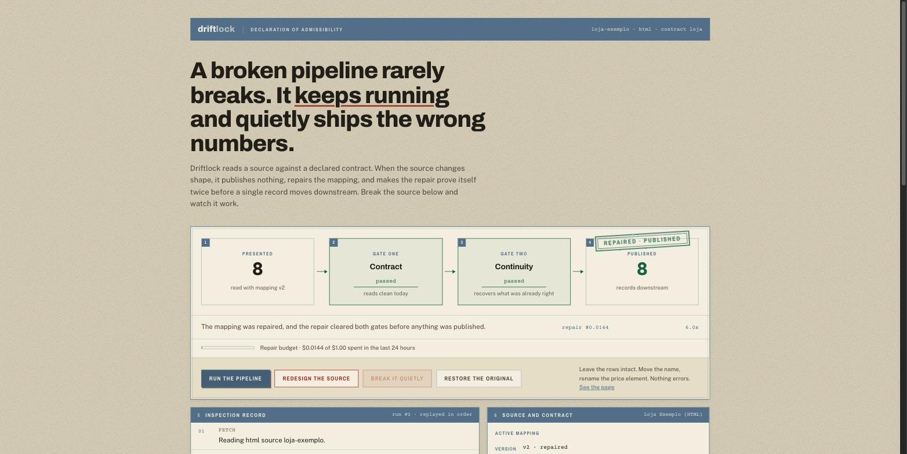
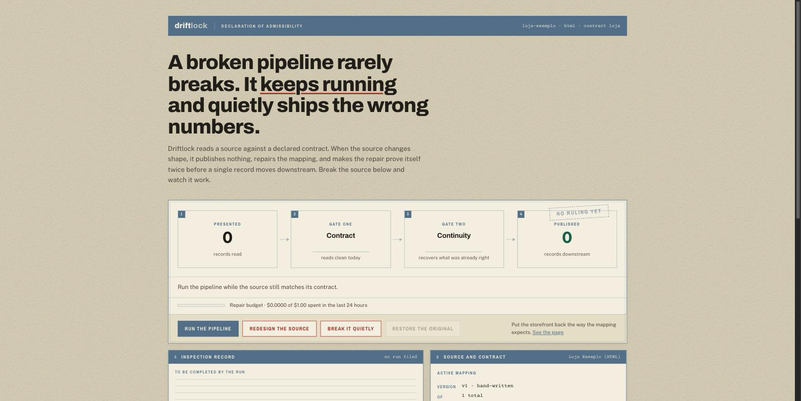
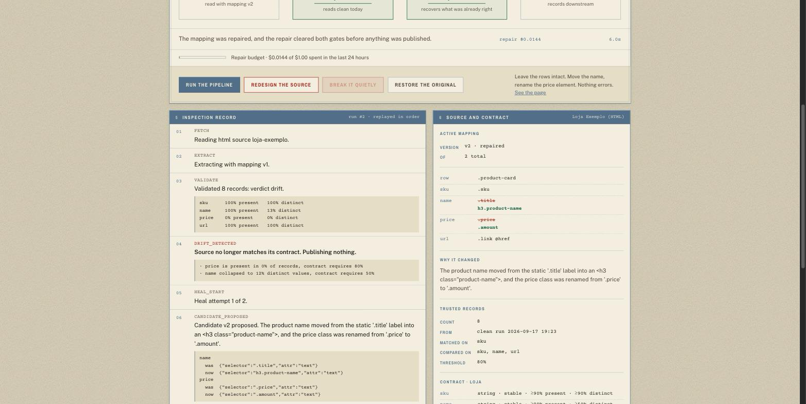

# Driftlock

**Data-contract enforcement for sources that change without telling you.** Driftlock reads a
source against a declared contract, blocks the batch when the source changes shape, repairs the
extraction mapping with an LLM, and makes the repair prove itself twice before a single record
moves downstream.

**[Try the live demo](https://driftlock-tf73.onrender.com/)** — break the source in one click and
watch the repair argue its way past both gates. Runs on a free instance, so the first request can
take about 50 seconds to wake it.



## The problem

A broken pipeline rarely breaks. The site renames a CSS class, the client renames a spreadsheet
column, the partner ships a new PDF layout — and nothing raises. The job keeps running and
quietly writes garbage for a week before anyone notices.

The two failure modes that never raise:

- **The field goes empty.** A selector matches nothing, so every row gets `null`.
- **The field collapses.** A selector drifts onto a header or a static label, so every row gets
  the *same* value.

Driftlock has a batch-level rule for each, because neither is visible one row at a time.

## Try it

The live demo is the same app, seeded fresh on every restart:



To run it locally instead:

```bash
./.venv/bin/python manage.py runserver
```

Then open <http://127.0.0.1:8000/>. The storefront the pipeline reads is served by this same app,
so the whole demo runs with no external site involved.

1. **Run the pipeline.** It matches the contract, publishes 8 records, and keeps them as the
   baseline any future repair has to recover.
2. **Break it quietly.** The product cards stay exactly where they are. The name moves out of
   `.title`, which becomes a static label on every card, and `.price` is renamed to `.amount`.
   Nothing errors. Run again: `price` is present in 0% of rows and `name` has collapsed to 12%
   distinct values, so the batch is blocked and the repair begins.
3. **Redesign the source.** The markup is rebuilt entirely and the row selector stops matching.

Every run writes its own record: what was read, what the validator measured, why the batch was
blocked, what the model proposed, and how each gate ruled on it.



## How a repair proves itself

The model proposes; it never decides. A candidate mapping is written as a new version with status
`candidate` and is promoted only when **both** gates open.

**Gate one — the contract.** Re-read today's payload with the candidate. The batch must satisfy
every declared rule: types, ranges, fill rates, distinct ratios, minimum record count.

**Gate two — continuity.** The candidate must recover the records already known to be correct,
matched by the contract's declared key and compared only on fields marked `stable`.

Neither gate is sufficient alone, and the test suite proves it in both directions:

- A candidate that fills `name` from the price column produces a batch that is present, distinct
  and correctly typed. Gate one waves it through. Gate two sees that the products are no longer
  named what they were named, and refuses it.
- A candidate that keeps the old, dead rules reproduces the trusted records perfectly — they were
  captured under those very rules — while leaving today's payload just as broken. Gate two is
  satisfied. Gate one refuses it.

### Why the proof is about content, not structure

The obvious design is to save old payloads and require a candidate to reproduce them. That cannot
work: the moment a source genuinely changes shape, a mapping written for the new layout can never
reproduce a capture of the old one. Replay asks the wrong question.

A redesign changes the packaging, not the facts. `TEC-001` is still the mechanical keyboard. So a
candidate proves itself by recovering records already known to be correct — and only on fields
declared stable, because a price is expected to move between runs while a product name is not.
Comparing volatile fields would reject honest repairs on ordinary data churn.

## What a contract declares

```python
ContractField(name="sku",   type="string", stable=True,  min_fill_rate=0.9, min_distinct_ratio=0.9,
              description="the product code shown on the card, e.g. TEC-001")
ContractField(name="price", type="number", stable=False, min_fill_rate=0.8, min_value=0,
              description="the current selling price in BRL, however it is written")
```

`description` is the anchor. Selectors are a cache of how to find a field today; the description
is what the field *is*, and it is what the healer reasons from when the mechanical rule dies.

`stable` decides what continuity compares. `min_fill_rate` and `min_distinct_ratio` are the two
silent-failure detectors.

## Architecture

| Path | What lives there |
|---|---|
| `contracts/engine/` | Validation, type coercion and the continuity check. Pure Python, no Django imports, unit-tested on its own. |
| `sources/adapters/` | HTML and CSV readers. Never validate, never coerce — they return what the source literally said, including `None`. |
| `pipeline/healing.py` | Proposes a repair through the Claude API with a typed schema, prices every call, and enforces a per-run dollar ceiling. |
| `pipeline/runner.py` | Orchestrates a run and narrates every decision into persisted events. |
| `frontend/` | Vite + React dashboard, served by Django as one deployment. |

Values are coerced from however humans wrote them: `R$ 1.234,56`, `$1,234.56`, `(1,234.56)` and
`1.234.567` all read correctly, and the one genuinely ambiguous case is documented in
`contracts/engine/coerce.py` rather than guessed at silently.

Run events are persisted rather than logged, which is what lets the dashboard replay a decision in
order after the fact, with no live connection to the run.

## Cost control

The healer is the only component that spends money, so every bound lives in one settings block:
attempts per run, dollars per run, and the character budget for the payload sent to the model.
HTML is pruned to its tag skeleton before it is sent — scripts, styles and prose are where nearly
all the bytes live and none of the selector signal does.

The budget check asks whether the *next* attempt fits rather than whether the budget is already
blown; a backward-looking check always overspends by one attempt.

A repair is also **scoped to the fields that actually broke**. Rules for healthy fields are carried
over mechanically, so a working rule cannot be rewritten no matter what the model returns — this is
a structural guarantee, not an instruction in the prompt, and it is covered by a test that feeds the
healer a model which rewrites everything. Narrowing the ask also cut output tokens by a third. A
repair on the demo source costs about $0.014 and takes four to six seconds.

### Limits on the public demo

The repair button spends real money on a real account and is open to anyone with the URL, so it
has two ceilings: a per-visitor rate limit, and a global cap on what the demo may spend in a
rolling 24 hours. The spend figure is summed from what runs actually recorded rather than kept in
a separate counter, so there is nothing to drift out of sync.

Past the cap the demo degrades to detection, not to silence: the source is still read, drift is
still caught, the batch still fails closed, and the run log says in plain words why no repair was
attempted.

## Running it

```bash
python3 -m venv .venv
./.venv/bin/pip install -r requirements-dev.txt
./.venv/bin/python manage.py migrate
./.venv/bin/python manage.py seed_demo

cd frontend && npm install && npm run build && cd ..
./.venv/bin/python manage.py collectstatic --no-input
./.venv/bin/python manage.py runserver
```

Set `ANTHROPIC_API_KEY` to enable repairs. Without it, drift is still detected and the batch still
fails closed — Driftlock simply blocks instead of attempting a repair.

```bash
./.venv/bin/python -m pytest      # 48 tests
```

## What it does not do yet

- **Two source kinds.** HTML and CSV. PDF and JSON APIs are the obvious next adapters, and the
  adapter interface is where they would go.
- **Runs synchronously.** The orchestrator is a plain callable with no queue coupling, so moving
  it onto Celery means wrapping `run_ingestion`, not rewriting it. That work is not done.
- **Continuity needs a declared key and one clean run.** A source that has never succeeded has
  nothing to be held to, and Driftlock refuses to promote anything against an empty baseline.
- **Single tenant.** No accounts, no per-user isolation. It is a demonstration of a mechanism.

## Licence

MIT.
